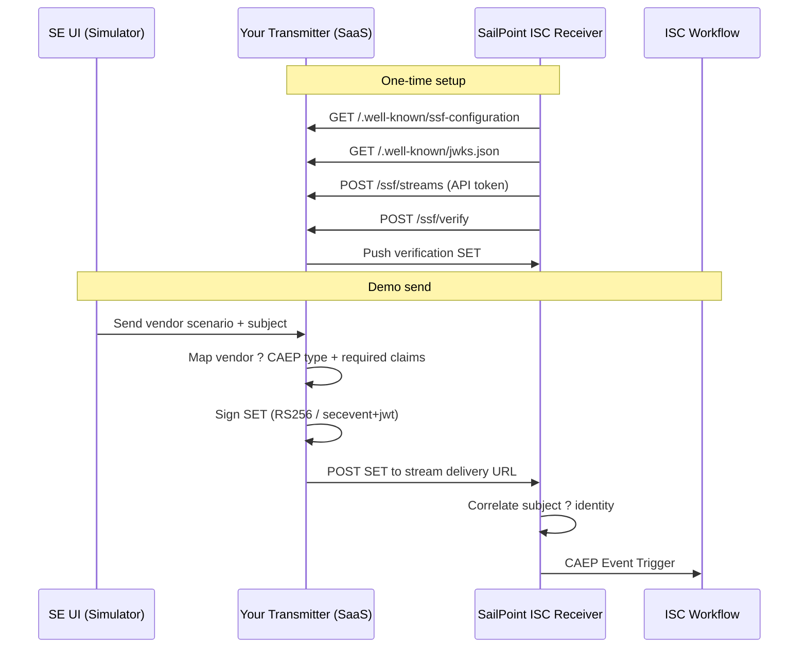

# How to Build the SSF Transmitter Application

**Status:** Recommended architecture (post PRD NO-GO)  
**Date:** July 23, 2026  
**Context:** Replacement approach for the Shared Signals Injector PRD desktop/webhook design

---

## Verdict

**Do not build the PRD’s desktop webhook client.**  
Build a **hosted SSF Transmitter** that SailPoint ISC can discover and trust — then put a thin SE UI on top of it.

The existing SSF Signal Portal already implements ~70% of this. **Productize that**, don’t start over.

---

## Architecture (what “transmitter” actually means)



**Hard rule:** ISC connects *to you*. You do not invent an ISC “Shared Signals webhook” and POST into it like Event Triggers.

### SailPoint ISC Receiver expectations

Per SailPoint Shared Signals documentation:

1. Admin creates an SSF **Receiver** in ISC (`Admin ? Connections ? Shared Signals`).
2. Connection is configured with:
   - **Discovery URL** of the transmitter
   - **Authentication** (API Token or OAuth 2.0)
   - Supported **CAEP event types**
3. ISC discovers the transmitter, registers a stream, and consumes signed Security Event Tokens (SETs).
4. Workflows fire via native **CAEP Event Triggers**.

### Supported ISC Receiver CAEP event types

- Device Compliance Change
- Risk Level Change
- Token Claims Change
- Credential Change
- Session Revoked

---

## Build it as 3 layers

### 1) Protocol core (must be right first)

Per-tenant transmitter identity:

| Endpoint | Job |
|---|---|
| `GET /t/{slug}/.well-known/ssf-configuration` | Discovery |
| `GET /t/{slug}/.well-known/jwks.json` | Public signing key |
| `POST/GET /t/{slug}/ssf/streams` | Stream create/list |
| `POST /t/{slug}/ssf/status` | Pause/enable |
| `POST /t/{slug}/ssf/verify` | Connection verification |
| Internal `sendSsfSignal()` | Build claims ? sign ? push SET |

**Data you must persist per tenant:**

- Signing key (private key in secure vault; public in JWKS)
- Transmitter API token (what ISC pastes into Receiver auth)
- Registered streams (`deliveryEndpointUrl`, `eventsRequested`, status)
- Optional: SailPoint OAuth credentials used for delivery/auth to ISC

> The current SSF Project repo already has this surface. Treat it as the foundation, not a prototype to throw away.

### 2) Event model (this is where the PRD failed)

Do **not** invent 25 SSF event types.

```text
Vendor narrative (CrowdStrike host isolated, Okta push bomb, etc.)
        ? map
CAEP type ISC supports
  (risk-level-change | credential-change | device-compliance-change
   | session-revoked | token-claims-change)
        ? plus
vendor, vendor_event_type, recommended_action
(custom claims for Workflow branching / demo narrative)
```

**Catalog fields to lock:**

- `vendor`
- `displayName`
- `triggerCode`
- `ssfEventType` (one of the supported CAEP short names)
- `defaultAction`
- Required CAEP claim defaults (or a shared claim builder, e.g. `caepRequiredClaims()`)

**Why this matters:** ISC validates required CAEP fields strictly (e.g. `credential_type` / `change_type` for credential-change; `current_level` / `previous_level` for risk-level-change). Missing claims cause parse failures even when HTTP delivery succeeds.

### 3) SE experience (demo UX only — after protocol works)

**Minimum viable SE surface:**

1. **Credentials** — ISC OAuth + Test Connection + copy Discovery URL / API token  
2. **Simulator** — vendor ? event ? subject ? Send Now  
3. **History** — success/fail + raw result  
4. **Admin catalog** — add/edit vendor scenarios without deploys  

**Nice-to-haves after that (PRD gaps worth adding):**

- Saved demo identities (email / UPN / accountId picker)
- Countdown / queued script sends
- Companion ISC Workflow JSON templates
- Preview that matches the **signed wire payload** exactly

---

## How to sequence the build

### Phase 0 — Prove the protocol (gate)

Before any polish:

1. Deploy transmitter publicly (`NEXT_PUBLIC_APP_URL` must be correct)
2. Create ISC Receiver with Discovery URL + API token
3. Pass **Verify Connection**
4. Send one `risk-level-change` for a real ISC identity
5. Confirm event in ISC + fire a native CAEP Workflow trigger

If this fails, stop. UI doesn’t matter yet.

### Phase 1 — Harden transmitter

- Respect stream `status` (don’t send to paused/disabled streams)
- Prefer stream `deliveryEndpointUrl` over manual receiver URL consistently
- Fix preview = wire payload parity
- Integration tests: discovery, stream create, verify SET, signed send
- Kill documentation drift on event-type names

### Phase 2 — Demo completeness

- Expand catalog to PRD narratives (CrowdStrike / Zscaler ok) **still mapped to CAEP**
- Identity picker (small saved-identity table — not a full spreadsheet product)
- Optional scheduler / demo script queue
- Ship 1–2 importable ISC Workflow templates that branch on CAEP type + vendor / `recommended_action`

### Phase 3 — SE org scale

Keep / strengthen:

- Multi-tenant isolation
- Vault-backed secrets
- Admin analytics
- MFA

Do **not** regress to per-laptop secret stores.

---

## What not to build

- Python desktop `.exe` / `.app` “SSF injector”
- Direct POST to a fictional ISC Shared Signals webhook
- 25 first-class SSF event URIs
- Re-implementing identity correlation inside a custom webhook Workflow when ISC already correlates subjects
- Poll delivery / full subject-management APIs unless a customer receiver requires them

---

## Stack choice

Keep the current stack:

| Layer | Choice | Why |
|---|---|---|
| App / routes | Next.js (App Router) | Transmitter endpoints + portal in one deployable unit |
| Data | Postgres + Prisma | Tenants, streams, logs, catalog |
| Secrets | Supabase Vault | Signing keys + OAuth client secrets |
| SET crypto | `jose` (RS256) | Spec-aligned `secevent+jwt` signing |
| Auth | Supabase Auth (+ optional TOTP MFA) | SE org access without home-rolled passwords |

**Hosting is mandatory:** ISC must reach Discovery / JWKS / streams from the public internet.

If someone demands “laptop-only,” the compromise is a **thin local controller** that calls the hosted transmitter API — never a local-only transmitter.

---

## Practical recommendation

| Option | Verdict |
|---|---|
| Build PRD desktop app | **No** |
| Greenfield new transmitter | **Wasteful** — a working transmitter already exists |
| **Productize current SSF Signal Portal** | **Yes** |

### Definition of done

An SE can:

1. Provision a tenant in the portal  
2. Wire SailPoint ISC via Discovery URL + API token  
3. Pass Verify Connection  
4. Send at least 3 CAEP types from realistic vendor stories  
5. Show a Workflow remediation in ISC  

…without touching live vendor APIs or local desktop packaging.

---

## Suggested backlog (ordered)

1. **Verify gate** — end-to-end ISC Receiver Verify Connection + one successful SET  
2. **Stream status gating** — never push to paused/disabled streams  
3. **Preview = wire payload** — SE sees exactly what ISC receives  
4. **Identity picker** — saved demo subjects (email / `iss_sub`)  
5. **Catalog expansion** — PRD narratives mapped onto supported CAEP types  
6. **Companion Workflow pack** — importable ISC Workflow JSON templates  
7. **Scheduler / demo queue** — countdown or multi-step script sends  
8. **Integration test harness** — discovery, streams, verify, signed delivery  

---

## Related artifacts

- PRD assessed: `PRD - Shared Signals Injector 7.22.26.docx`
- PRD assessment PDF: `SSF Injector PRD Assessment - Go No-Go 7.22.26.pdf`
- Portal vs goals assessment PDF: `SSF Portal vs PRD Goals Assessment 7.22.26.pdf`
- Existing app: `/Users/mgiblin/Projects/SSF Project` (SSF Signal Portal)
- SailPoint docs: [Shared Signals Framework](https://documentation.sailpoint.com/saas/help/shared_signals/index.html)
- SailPoint docs: [Managing Receivers](https://documentation.sailpoint.com/saas/help/shared_signals/managing_receivers.html)
- Spec: [OpenID Shared Signals Framework 1.0](https://openid.net/specs/openid-sharedsignals-framework-1_0-final.html)
